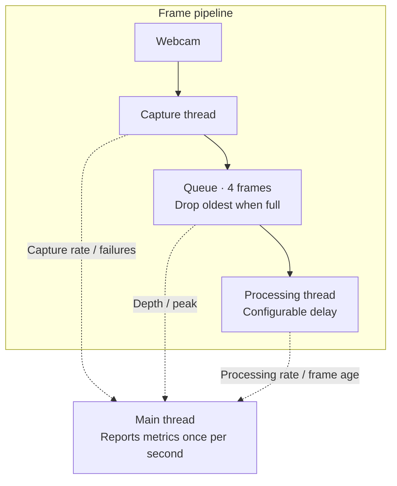

# Linux Camera Service (C++20)

A C++20 webcam service for Linux, built with OpenCV.

I started with a simple capture loop. Adding 100 ms of simulated processing
dropped it to about 9 FPS. This project grew out of separating those two jobs:
keep reading the camera, let processing run at its own speed, and decide what
to do with the frames it cannot keep up with.

## What works so far

Capture and processing run on separate threads, with room for four frames
between them. If that queue fills up, the oldest waiting frame is replaced by
the new one. Each queued frame has its own copy of the pixels, a sequence number,
and a timestamp.

The processor currently sleeps to simulate work. Its delay can be changed with
`--processing-delay-ms`, so the same program can test both a fast consumer and
one that falls behind. Once a second, it prints capture and processing FPS,
drops, queue depth, and how long frames waited before processing.

The current version runs in the terminal and uses camera index `0`. Ctrl-C
requests shutdown; after capture stops, the processor finishes the remaining
queued frames. Automatic camera reconnection is the next milestone.

## Architecture



Solid arrows show where frames go; dotted arrows show the measurements read by
the main thread. The queue holds waiting frames only. The processor may also
have one frame in progress.

## Build

### Dependencies

Ubuntu/Debian example:

```bash
sudo apt update
sudo apt install build-essential cmake pkg-config libopencv-dev v4l-utils
```

Check that Linux can see the camera:

```bash
v4l2-ctl --list-devices
```

### Compile

From the repository root:

```bash
cmake -S camera_service -B build-camera
cmake --build build-camera
```

If a local `ccache` configuration prevents compilation, prepend
`env CCACHE_DISABLE=1` to the CMake commands.

## Run

```bash
./build-camera/camera_view --processing-delay-ms 100
```

Stop with Ctrl-C.

The optional delay simulates expensive work such as image encoding, inference,
or a slow downstream consumer:

```bash
./build-camera/camera_view --processing-delay-ms 0
./build-camera/camera_view --processing-delay-ms 50
./build-camera/camera_view --processing-delay-ms 100
./build-camera/camera_view --processing-delay-ms 200
```

## Metrics

Example output:

```text
metrics capture_fps=29.95 processing_fps=9.98 dropped_frames=203 \
queue_size=4 frame_age_ms=106.60 frame_age_avg_ms=112.26 \
frame_age_max_ms=117.90 queue_high_water=4 read_failures=0
```

| Metric | Meaning |
| --- | --- |
| `capture_fps` | Frames read from the camera per second. |
| `processing_fps` | Frames completed by the consumer per second. |
| `dropped_frames` | Total oldest frames discarded when the queue was full. |
| `queue_size` | Current number of queued frames. |
| `queue_high_water` | Largest queue size observed in the reporting interval. |
| `frame_age_*_ms` | Time from capture timestamp until processing begins. |
| `read_failures` | Failed or empty camera reads. |

## Measured overload behavior

Measurements from a webcam reporting roughly 30 FPS with queue capacity 4:

| Processing delay | Capture FPS | Processing FPS | Drops | Queue behavior | Frame age |
| --- | ---: | ---: | --- | --- | --- |
| 0 ms | ~29–30 | ~29–30 | 0 | Empty; high-water 1 | Below 1 ms |
| 100 ms | ~29–30 | ~10 | ~20/sec | Full; high-water 4 | Roughly 105–135 ms |

The 100 ms test demonstrates the intended policy: capture throughput remains
near the camera rate, while old frames are dropped and frame age remains
bounded instead of accumulating indefinitely.

## Source layout

```text
camera_service/
├── include/camera_service/
│   ├── frame.hpp                 # Frame pixels and timestamps
│   ├── bounded_frame_queue.hpp   # Thread-safe bounded queue interface
│   ├── pipeline_metrics.hpp      # Shared metric state
│   ├── processor.hpp             # Consumer-loop interface
│   └── capture.hpp               # Producer-loop interface
└── src/
    ├── main.cpp                  # Startup, reporting, shutdown
    ├── capture.cpp               # OpenCV producer thread
    ├── processor.cpp             # Consumer thread and age measurement
    └── bounded_frame_queue.cpp   # Queue synchronization and drop policy
```

## Next milestones

- Add camera disconnect detection, exponential-backoff retry, and recovery-time
  measurement.
- Add explicit service states: `Starting`, `Streaming`, `Disconnected`,
  `Stopping`, and `Stopped`.
- Run sanitizers and document debugging findings.
- Publish a small experiment table for several delays and queue capacities.

See [TODO.md](TODO.md) for the live implementation checklist.
